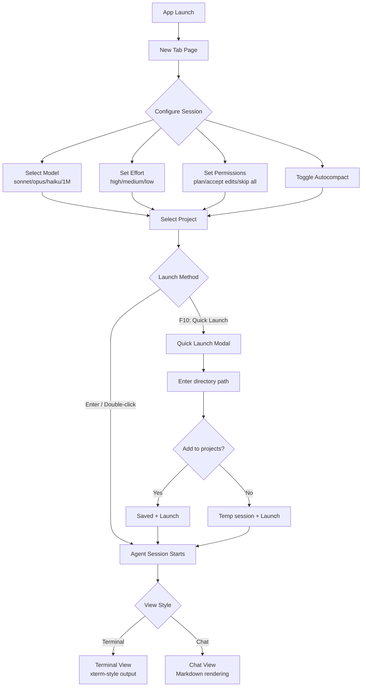
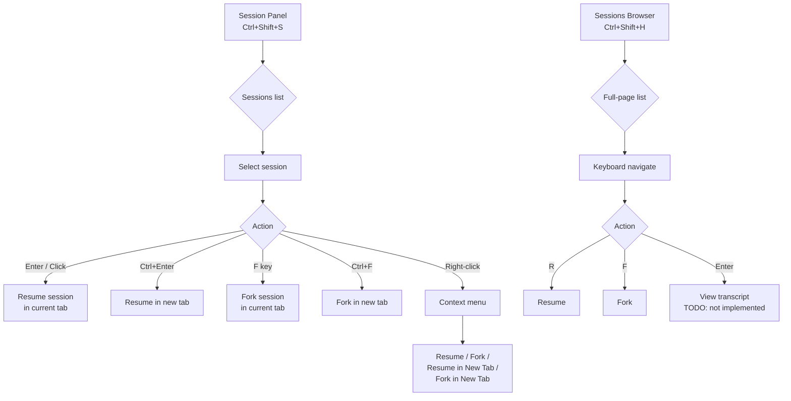
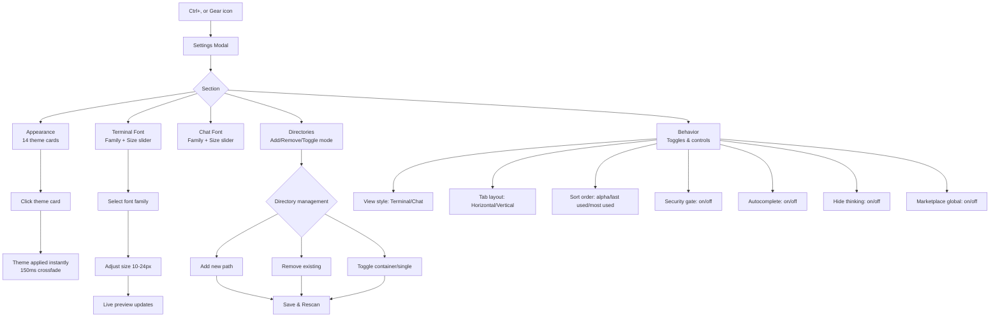
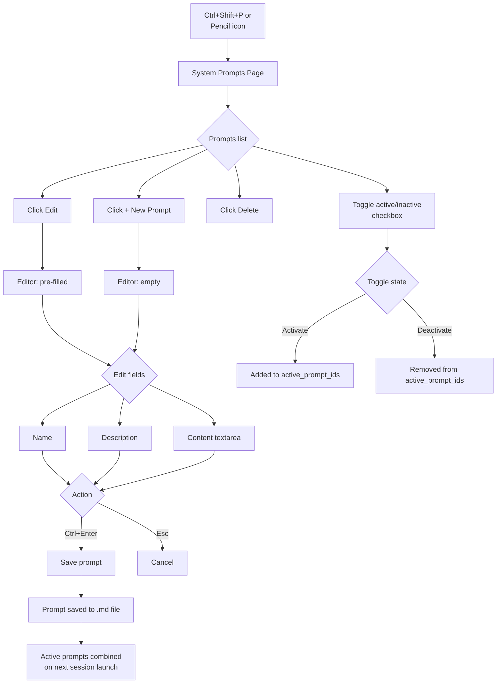
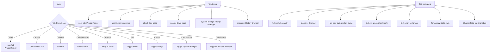
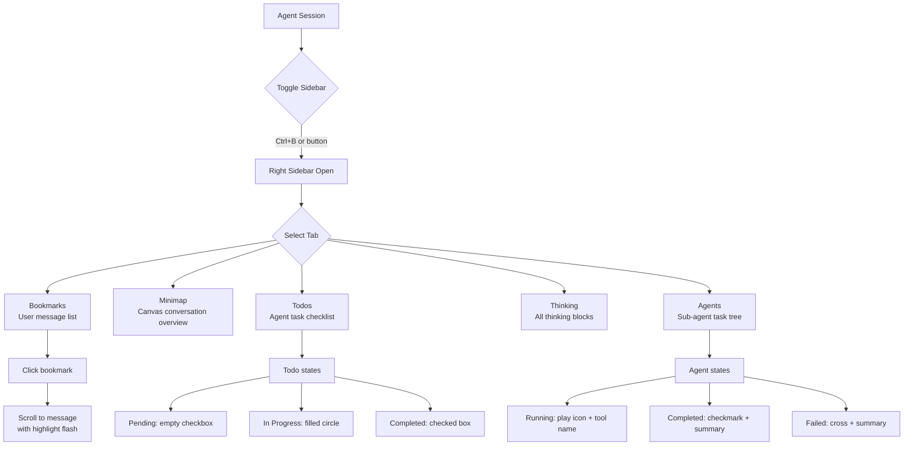
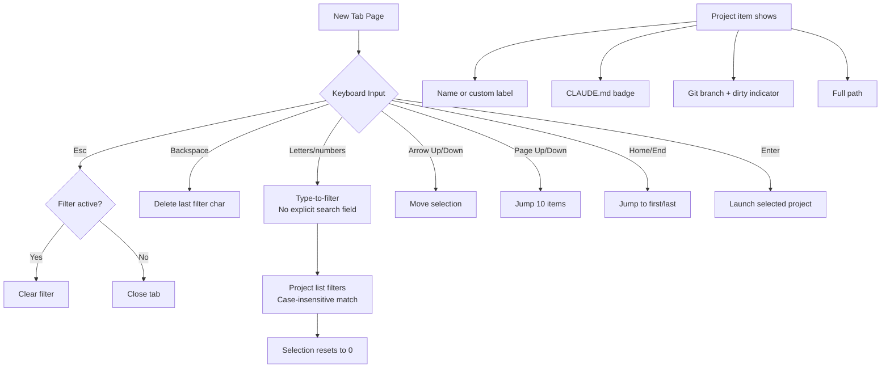

# Anvil -- User Flows

## 1. Core Flow: Launch Agent Session



## 2. Agent Session Interaction Loop

```mermaid
flowchart TD
    A[Agent Initialized] --> B{Input State}
    B -->|awaiting_input| C[User types message]
    C --> D{Input Type}
    D -->|Plain text| E[Submit message]
    D -->|/ prefix| F[Command Menu appears]
    D -->|@ prefix| G[Mention Menu appears]
    D -->|Drag & Drop| H[File attachment chips]
    D -->|Paste image| I[Image attachment]
    E --> J[Agent Processing]
    F --> K[Select command]
    K -->|/clear /compact /theme etc.| L[Local action]
    K -->|SDK skill| M[Skill invocation]
    G --> N[Select agent mention]
    N --> E
    J --> O{Agent Response}
    O -->|Text| P[Streaming assistant message]
    O -->|Tool call| Q[Tool card appears]
    O -->|Permission needed| R[Permission card]
    O -->|Thinking| S[Thinking block]
    O -->|Error| T[Error card]
    O -->|Result| U[Result bar: cost, tokens, turns]
    R --> V{User decision}
    V -->|Y: Yes| W[Allow once]
    V -->|A: Allow session| X[Allow for session]
    V -->|N: No| Y[Deny]
    W & X & Y --> J
    Q --> J
    P --> B
    U --> B

    B -->|processing| Z[Activity spinner<br/>Ctrl+C to interrupt]
    Z --> O
```

## 3. Session Management Flow



## 4. Settings & Configuration Flow



## 5. System Prompts Flow



## 6. Tab Management Flow



## 7. Right Sidebar Flow



## 8. Project Picker Navigation Flow


