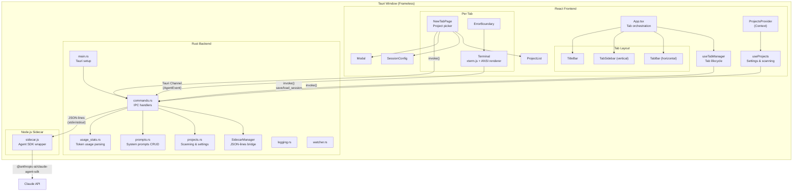
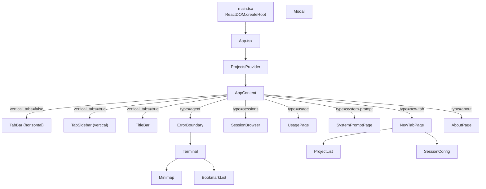

# Anvil -- Technical Documentation

**Version:** 1.0.0
**Platform:** Windows only
**Last verified:** 2026-03-15

---

## Table of Contents

1. [Project Overview](#1-project-overview)
2. [Getting Started](#2-getting-started)
3. [Architecture Overview](#3-architecture-overview)
4. [Rust Backend](#4-rust-backend)
5. [Node.js Sidecar](#5-nodejs-sidecar)
6. [React Frontend](#6-react-frontend)
7. [IPC Protocol](#7-ipc-protocol)
8. [Keyboard Shortcuts](#8-keyboard-shortcuts)
9. [Configuration](#9-configuration)
10. [Architecture Notes](#10-architecture-notes)
11. [Development Guide](#11-development-guide)

---

## 1. Project Overview

<!-- Source: CLAUDE.md:1-3 -->

Anvil is a Windows-only Tauri 2 desktop application for selecting and launching Claude Code Agent SDK sessions in tabbed terminals. Users select a project from a scanned directory list, choose a model and settings, then launch an interactive agent session rendered in an embedded xterm.js terminal with custom ANSI rendering.

### Tech Stack

| Layer | Technology | Version |
|-------|-----------|---------|
| Frontend framework | React | 19.x |
| Language | TypeScript | 5.7+ |
| Bundler | Vite | 6.x |
| Terminal emulator | xterm.js (with WebGL addon) | 5.5.0 |
| Backend runtime | Rust (edition 2021) | -- |
| Desktop framework | Tauri | 2.x |
| Agent SDK | `@anthropic-ai/claude-agent-sdk` | latest |
| Sidecar runtime | Node.js | -- |
| Win32 integration | `windows` crate (DWM, filesystem) | 0.62 |

**Source:** `app/package.json`, `app/src-tauri/Cargo.toml`, `sidecar/package.json`

### Key Capabilities

<!-- Source: main.rs:113-139, types.ts:8-23, sidecar/sidecar.js:1-4 -->

- Tabbed terminal interface with concurrent agent sessions via Claude Agent SDK
- Project directory scanning with git branch/dirty status detection (`projects.rs:218-255`)
- 5 Claude models, 3 effort levels (`types.ts:63-71`)
- Session resume, fork, and live model switching via Agent SDK
- 10 dark themes (8 standard + 2 retro) with live switching (`types.ts:98-191`)
- Session restore across app restarts (`useTabManager.ts:49-72`)
- File drag-and-drop into agent input (`Terminal.tsx:716-730`)
- Configurable font family and size (`types.ts:34-53`)
- Custom frameless window with resize handles and two tab layouts (horizontal bar or vertical sidebar)
- System prompts managed as `.md` files with YAML frontmatter (`prompts.rs`)
- ANSI-rendered agent output with tool use boxes, permission prompts, animated spinner (`ansiRenderer.ts`, `Terminal.tsx:533-561`)
- Bookmark navigation within terminal sessions
- Usage statistics dashboard reading Claude Code JSONL logs (`usage_stats.rs`)
- Session browser for listing and inspecting past Agent SDK sessions

---

## 2. Getting Started

### Prerequisites

- **Windows 11** (or Windows 10)
- **Node.js** (for frontend build and sidecar runtime -- resolved via PATH, `%LOCALAPPDATA%\anvil\node\`, or `%ProgramFiles%\nodejs\`)
- **Rust toolchain** (for Tauri backend)
- **Claude Agent SDK** -- installed automatically by the sidecar (`npm install --production` in `sidecar/`)

<!-- Source: sidecar.rs:109-149, sidecar.rs:410-439 -->

### Development

```bash
# Install frontend dependencies
cd app
npm install

# Install sidecar dependencies (auto-runs on first launch, but can be done manually)
cd sidecar
npm install

# Run in development mode (starts Vite dev server + Tauri)
cargo tauri dev

# Build release binary
cargo tauri build
```

**Source:** `app/src-tauri/tauri.conf.json:6-11`

- Dev server URL: `http://localhost:1420`
- Frontend dist output: `app/dist/`
- `beforeDevCommand`: `npm run dev`
- `beforeBuildCommand`: `npm run build` (runs `tsc && vite build`)

### Window Configuration

The app launches a single frameless window:

| Property | Value |
|----------|-------|
| Label | `main` |
| Title | `Anvil` |
| Default size | 1200 x 800 |
| Minimum size | 800 x 500 |
| Decorations | `false` (custom title bar) |
| CSP | `default-src 'self'; style-src 'self' 'unsafe-inline'` |

**Source:** `app/src-tauri/tauri.conf.json:14-28`

---

## 3. Architecture Overview

### System Diagram



### Data Flow

<!-- Source: main.rs:19-150, sidecar.rs:108-149, Terminal.tsx:589-681, sidecar.js:20-169 -->

1. **App startup:** `main.rs` initializes logging, creates a `SidecarManager` (which finds Node.js, installs sidecar dependencies if needed, and spawns the sidecar process), syncs the marketplace, then launches the Tauri application.
2. **Frontend mount:** React renders `App` inside `ProjectsProvider`. `useProjects` loads settings and usage data from disk via IPC, then scans project directories. `useTabManager` restores saved sessions from `load_session`.
3. **Project selection:** User picks a project in `NewTabPage`, which calls `onLaunch` to convert the tab from `new-tab` to `agent` type.
4. **Agent spawn:** `Terminal` component mounts, creates an xterm.js instance, calls `spawnAgent()` which opens a Tauri `Channel<AgentEvent>` and invokes `spawn_agent` IPC. The backend sends a `create` command to the sidecar over stdin. The sidecar creates a `query()` session via the Agent SDK.
5. **Event loop:** The sidecar emits JSON-line events to stdout. The Rust `SidecarManager` reads these, converts them to `AgentEvent` variants, and routes them to the matching tab's Tauri Channel. The frontend's `handleAgentEvent` callback renders each event as ANSI text in xterm.js via `renderAgentEvent()`.
6. **User input:** When the SDK needs input (emits `input_required`), the terminal enters `awaiting_input` state. User types into a buffer echoed locally, then on Enter the text is sent via `agent_send` IPC to the sidecar's `send` command, which resolves the SDK's input stream promise.
7. **Permission handling:** Tool permission requests arrive as `permission` events. The terminal enters `awaiting_permission` state and shows a Y/n prompt. User response is sent via `agent_permission` IPC.
8. **Cleanup:** On tab close, `killAgent()` sends a `kill` command to the sidecar (which aborts the SDK query). On window close, `SidecarManager::shutdown()` closes stdin and kills the sidecar process.

---

## 4. Rust Backend

### Module Overview

<!-- Source: main.rs:4-12 -->

| Module | File | Purpose |
|--------|------|---------|
| `main` | `main.rs` | App entry point, Tauri setup, window close handler |
| `commands` | `commands.rs` | All Tauri IPC command handlers |
| `sidecar` | `sidecar.rs` | Node.js sidecar lifecycle and JSON-lines protocol |
| `projects` | `projects.rs` | Project scanning, settings/usage persistence |
| `prompts` | `prompts.rs` | System prompt file CRUD (`.md` with YAML frontmatter) |
| `usage_stats` | `usage_stats.rs` | Token usage statistics from Claude Code JSONL logs |
| `logging` | `logging.rs` | File + stderr logging with macros |
| `watcher` | `watcher.rs` | Filesystem watcher for project directory changes |
| `marketplace` | `marketplace.rs` | Anvil marketplace sync |
| `autocomplete` | `autocomplete.rs` | File path autocomplete for agent input |

### main.rs

**Source:** `app/src-tauri/src/main.rs`

<!-- Source: main.rs:1-150 -->

Entry point. Hides the console window in release builds via `#![cfg_attr(not(debug_assertions), windows_subsystem = "windows")]`. Sets a global panic hook that logs panics from any thread. Creates a `SidecarManager` (wrapped in `Arc`), then builds the Tauri application with all IPC handlers registered. Includes plugins for single instance, clipboard manager, and shell access. On window close (label `"main"`), calls `sidecar_manager.shutdown()` to terminate the sidecar process.

**Setup phase** (`main.rs:64-111`):
1. Loads initial settings.
2. Creates a `ProjectWatcher` for filesystem monitoring.
3. Syncs the anvil-toolset marketplace (synchronous to avoid race conditions).
4. Auto-grants clipboard read permission via WebView2 COM API to suppress the permission dialog.

### SidecarManager

**Source:** `app/src-tauri/src/sidecar.rs`

<!-- Source: sidecar.rs:98-401 -->

The `SidecarManager` manages a single long-lived Node.js child process that wraps the `@anthropic-ai/claude-agent-sdk`. All agent sessions for all tabs share this one sidecar process, multiplexed by `tabId`.

**Fields:**

| Field | Type | Purpose |
|-------|------|---------|
| `stdin` | `Mutex<Option<ChildStdin>>` | Write end of sidecar stdin pipe |
| `channels` | `Arc<Mutex<HashMap<String, Channel<AgentEvent>>>>` | Per-tab event channels |
| `oneshots` | `Arc<Mutex<HashMap<String, oneshot::Sender<Value>>>>` | One-shot responses for queries (list_sessions, get_messages) |
| `available` | `AtomicBool` | Whether sidecar is running |
| `_process` | `Mutex<Option<Child>>` | Sidecar child process handle |
| `unavailable_reason` | `Mutex<Option<String>>` | Human-readable reason if unavailable |

**Initialization** (`SidecarManager::new()`, `sidecar.rs:109-149`):

1. Finds Node.js via `find_node()`: checks PATH, then `%LOCALAPPDATA%\anvil\node\node.exe`, then `%ProgramFiles%\nodejs\node.exe`.
2. Ensures sidecar dependencies are installed (`ensure_deps()`, `sidecar.rs:152-189`): checks for `node_modules` directory, runs `npm install --production` if missing.
3. Resolves the sidecar directory (`resolve_sidecar_dir()`, `sidecar.rs:192-216`): production mode looks for `sidecar/` next to the exe; dev mode traverses up from `target/debug/` to find the project root.
4. Starts the sidecar process (`start_sidecar()`, `sidecar.rs:218-351`): spawns `node sidecar.js` with `CREATE_NO_WINDOW` flag.

**Reader threads:**

- **stdout reader** (`sidecar.rs:247-334`): Reads JSON-lines from sidecar stdout using `BufReader`. Deserializes each line into a `SidecarEvent`, converts to `AgentEvent`, and sends to the matching tab's Tauri Channel. Handles special `sessions` and `messages` events via oneshot channels. Removes the channel on `exit` events.
- **stderr reader** (`sidecar.rs:337-348`): Logs all sidecar stderr output to the Anvil log file.

**AgentEvent enum** (`sidecar.rs:15-37`):

```rust
pub enum AgentEvent {
    Assistant { text: String, streaming: bool },
    ToolUse { tool: String, input: serde_json::Value },
    ToolResult { tool: String, output: String, success: bool },
    Permission { tool: String, description: String },
    InputRequired {},
    Thinking { text: String },
    Status { status: String, model: String },
    Progress { message: String },
    Result {
        cost: f64, input_tokens: u64, output_tokens: u64,
        cache_read_tokens: u64, cache_write_tokens: u64,
        turns: u32, duration_ms: u64, is_error: bool, session_id: String,
    },
    Error { code: String, message: String },
    Exit { code: i32 },
}
```

Serialized with `serde(rename_all = "camelCase", tag = "type")`.

**Key methods:**

| Method | Signature | Description |
|--------|-----------|-------------|
| `send_command` | `(&self, cmd: &Value) -> Result<(), String>` | Serializes JSON, writes to sidecar stdin with newline, flushes |
| `register_channel` | `(&self, tab_id: &str, channel: Channel<AgentEvent>)` | Associates a Tauri Channel with a tab ID for event routing |
| `unregister_channel` | `(&self, tab_id: &str)` | Removes a tab's channel |
| `register_oneshot` | `(&self, key: &str) -> Receiver<Value>` | Creates a one-shot channel for query responses |
| `shutdown` | `(&self)` | Drops stdin (triggers sidecar's `rl.on('close')`), then kills the process |

### Project Scanning

**Source:** `app/src-tauri/src/projects.rs`

#### scan_projects (`projects.rs`)

1. Iterates each parent directory in `project_dirs`.
2. Lists immediate subdirectories, skipping hidden directories (names starting with `.`).
3. Processes directories in chunks of 8 threads.
4. For each directory, calls `scan_one_project()`.
5. Also includes `single_project_dirs` directly (not scanned for subdirs).

#### scan_one_project

For each directory:
1. Reads the directory name as the project name.
2. Checks for `CLAUDE.md` file existence.
3. Runs `git status --branch --porcelain=v2` to extract branch name and dirty status.
4. Returns a `ProjectInfo` struct.

**ProjectInfo** (`projects.rs`):

```rust
pub struct ProjectInfo {
    pub path: String,
    pub name: String,
    pub label: Option<String>,
    pub branch: Option<String>,
    pub is_dirty: bool,
    pub has_claude_md: bool,
}
```

Serialized with `serde(rename_all = "camelCase")`.

#### create_project

Validates the project name (no path separators, no `..`, no ANSI escape sequences). Creates the directory with `create_dir_all`. Optionally runs `git init`.

### Settings and Persistence

**Source:** `app/src-tauri/src/projects.rs`

<!-- Source: projects.rs:16-66 -->

All data files are stored in `dirs::data_local_dir() / "anvil"` (typically `%LOCALAPPDATA%\anvil`).

| File | Path | Purpose |
|------|------|---------|
| Settings | `anvil-settings.json` | User preferences |
| Settings backup | `anvil-settings.json.bak` | Previous settings |
| Usage data | `anvil-usage.json` | Project usage tracking |
| Session data | `anvil-session.json` | Tab restore state |
| Log file | `anvil.log` | Application log (next to exe) |

#### Settings struct (`projects.rs:26-66`)

| Field | Type | Default |
|-------|------|---------|
| `version` | `u32` | `1` |
| `model_idx` | `usize` | `0` |
| `effort_idx` | `usize` | `0` |
| `sort_idx` | `usize` | `0` |
| `theme_idx` | `usize` | `0` |
| `font_family` | `String` | `"Cascadia Code"` |
| `font_size` | `u32` | `14` |
| `skip_perms` | `bool` | `false` |
| `autocompact` | `bool` | `false` |
| `active_prompt_ids` | `Vec<String>` | `[]` |
| `security_gate` | `bool` | `true` |
| `project_dirs` | `Vec<String>` | `["D:\\Projects"]` or `ANVIL_PROJECTS_DIR` env var |
| `single_project_dirs` | `Vec<String>` | `[]` |
| `project_labels` | `HashMap<String, String>` | `{}` |
| `vertical_tabs` | `bool` | `false` |
| `sidebar_width` | `u32` | `200` |
| `extra` | `HashMap<String, Value>` | `{}` (serde flatten, forward-compatible) |

**Save strategy:** Atomic write via temp file + rename. Before overwriting, the current file is backed up to `.bak`. Load falls back to backup if primary is corrupt.

#### UsageData

```rust
pub type UsageData = HashMap<String, UsageEntry>;

pub struct UsageEntry {
    pub last_used: f64,   // Unix timestamp (seconds)
    pub count: u64,       // Total launch count
}
```

`record_usage()` is serialized with a static `Mutex` to prevent TOCTOU races.

#### Session persistence

Session data is an opaque `serde_json::Value` with a 1 MB size cap. Written atomically via temp file + rename.

### System Prompts

**Source:** `app/src-tauri/src/prompts.rs`

<!-- Source: prompts.rs:1-225 -->

System prompts are stored as `.md` files in a `data/prompts/` directory (next to the exe in production, `src-tauri/data/prompts/` in development). Each file uses YAML frontmatter for metadata:

```markdown
---
name: "My Prompt"
description: "What this prompt does"
---

Actual prompt content here...
```

**CRUD operations:**

| Function | Description |
|----------|-------------|
| `load_builtin_prompts()` | Reads all `.md` files, parses frontmatter, returns sorted list |
| `save_prompt(name, desc, content)` | Creates a new `.md` file with slugified filename |
| `update_prompt(id, name, desc, content)` | Updates existing file, renames if name changed |
| `delete_prompt(id)` | Deletes the `.md` file |

**Prompt composition** (in `App.tsx:73-79`): Active prompts (selected by `active_prompt_ids` in settings) are concatenated and passed to `spawnAgent()` as the `systemPrompt` parameter. The sidecar passes this to the SDK via `options.systemPrompt.append`.

### Usage Statistics

**Source:** `app/src-tauri/src/usage_stats.rs`

<!-- Source: usage_stats.rs:1-50 -->

Parses Claude Code's JSONL conversation logs from `%USERPROFILE%/.claude/projects/*/`. Computes per-day and per-model token usage and cost estimates over a configurable window (default 7 days). Uses model-specific pricing (opus/haiku/sonnet) for cost calculation.

### Logging

**Source:** `app/src-tauri/src/logging.rs`

<!-- Source: logging.rs:1-51 -->

- Log file is placed next to the executable.
- Log **rotation** on startup: `.log` -> `.log.1` -> `.log.2` -> `.log.3` (keeps up to 3 rotated files).
- Mid-session rotation when file reaches 10 MB.
- Output goes to both stderr and the log file.
- Timestamp format: `YYYY-MM-DD HH:MM:SS.mmm` (UTC).
- Sanitizes newlines in log messages to prevent log forging.
- Only flushes on ERROR level to reduce syscalls.
- Four macros: `log_info!`, `log_error!`, `log_warn!`, `log_debug!`.

### ProjectWatcher

**Source:** `app/src-tauri/src/watcher.rs`

<!-- Source: watcher.rs:1-50 -->

Watches project container directories for create/remove/rename events. Uses the `notify` crate with trailing-edge debounce (1 second quiet period). Emits `projects-changed` Tauri event to trigger frontend rescan. Updated when settings change (via the `save_settings` command).

---

## 5. Node.js Sidecar

**Source:** `sidecar/sidecar.js`

<!-- Source: sidecar/sidecar.js:1-501, sidecar/package.json:1-10 -->

The sidecar is a standalone Node.js process that wraps the `@anthropic-ai/claude-agent-sdk`. It communicates with the Rust backend via JSON-lines over stdin (commands) and stdout (events), with stderr used for logging.

### Dependencies

| Package | Version | Purpose |
|---------|---------|---------|
| `@anthropic-ai/claude-agent-sdk` | latest | Claude Code agent API |

### Protocol

**Commands (stdin, JSON-lines):**

| Command | Fields | Description |
|---------|--------|-------------|
| `create` | `tabId, cwd, model, effort, systemPrompt, skipPerms, allowedTools?` | Create new agent session |
| `send` | `tabId, text` | Send user message to session |
| `resume` | `tabId, sessionId, cwd, model, effort, systemPrompt?, allowedTools?` | Resume an existing session |
| `fork` | `tabId, sessionId, cwd, model, effort, systemPrompt?, allowedTools?` | Fork (branch from) an existing session |
| `kill` | `tabId` | Kill a session |
| `permission_response` | `tabId, allow` | Respond to a tool permission request |
| `set_model` | `tabId, model` | Change model mid-session |
| `list_sessions` | `tabId, cwd` | List past SDK sessions |
| `get_messages` | `tabId, sessionId, dir` | Get messages from a past session |

**Events (stdout, JSON-lines):**

| Event | Fields | Description |
|-------|--------|-------------|
| `ready` | `tabId: "_control"` | Sidecar initialization complete |
| `assistant` | `tabId, text, streaming` | Assistant text (streaming delta or complete) |
| `tool_use` | `tabId, tool, input, toolUseId` | Tool invocation |
| `tool_result` | `tabId, tool, output, success` | Tool execution result (via `tool_use_summary`; `tool` is always `"summary"`) |
| `permission` | `tabId, tool, description, toolUseId` | Permission request for a tool |
| `input_required` | `tabId` | SDK waiting for user input |
| `thinking` | `tabId, text` | Extended thinking delta |
| `status` | `tabId, status, model` | Session status change |
| `progress` | `tabId, message, tool` | Tool progress update |
| `result` | `tabId, cost, inputTokens, outputTokens, ...` | Turn result with usage stats |
| `error` | `tabId, code, message` | Error (query, rate limit, etc.) |
| `exit` | `tabId, code` | Session ended |
| `sessions` | `tabId, list` | Response to `list_sessions` |
| `messages` | `tabId, sessionId, messages` | Response to `get_messages` |

### Session Lifecycle

<!-- Source: sidecar.js:20-169 -->

1. **Create:** `handleCreate()` builds SDK options (model, effort, system prompt appended to `claude_code` preset, permission mode), creates an async generator `inputStream()` that yields user messages on demand, and calls `query()` with it. When `skipPerms` is true, the SDK uses `bypassPermissions` mode.
2. **Input flow:** The `inputStream` generator blocks on a Promise. When the frontend sends a `send` command, `handleSend()` resolves the pending promise (or queues the text). The generator yields a `user` message to the SDK.
3. **Output consumption:** `consumeQuery()` iterates the async generator from `query()`, mapping SDK message types to events:
   - `assistant` -> extract text blocks and tool_use blocks
   - `stream_event` -> partial streaming deltas (text_delta, thinking_delta)
   - `result` -> usage stats, then emit `input_required` for next turn
   - `tool_progress` -> progress updates
   - `tool_use_summary` -> tool result summaries
   - `rate_limit_event` -> rate limit warnings/rejections
4. **Streaming deduplication:** A `hasStreamedText` flag tracks whether text was already emitted via `stream_event` deltas. If so, both text and thinking blocks in the complete `assistant` message are skipped to avoid duplication.
5. **Permission handling:** When `skipPerms` is false, the `canUseTool` callback emits a `permission` event and returns a Promise. `handlePermissionResponse()` resolves it with `{behavior: "allow"}` or `{behavior: "deny", message: "Denied by user"}`.
6. **Kill:** `handleKill()` pushes `null` into the input stream (sentinel), aborts the controller, resolves any pending permission as `deny`, and calls `query.close()`.
7. **Shutdown:** When stdin closes (Rust drops the handle), all sessions are killed and the process exits.

---

## 6. React Frontend

### Component Hierarchy



### Components

#### App (`App.tsx`)

**Source:** `app/src/App.tsx`

<!-- Source: App.tsx:1-358 -->

Root component. Wraps everything in `ProjectsProvider`. The inner `AppContent` uses `useTabManager` for tab state and renders:

- 8 resize handles for the frameless window (using `appWindow.startResizeDragging`)
- Either `TabBar` (horizontal) or `TitleBar` + `TabSidebar` (vertical), controlled by `settings.vertical_tabs`
- A `.tab-content` container with one panel per tab

Tab types and their components:

| Type | Component |
|------|-----------|
| `"new-tab"` | `NewTabPage` |
| `"agent"` | `Terminal` (wrapped in `ErrorBoundary`) |
| `"about"` | `AboutPage` |
| `"usage"` | `UsagePage` |
| `"system-prompt"` | `SystemPromptPage` |
| `"sessions"` | `SessionBrowser` |

**System prompt composition** (`App.tsx:73-79`): Loads all prompts from Rust on mount. Filters by `active_prompt_ids` from settings, concatenates content with `\n\n`, passes to each `Terminal` instance.

**Global keyboard shortcuts** (`App.tsx:105-136`):

| Key | Action |
|-----|--------|
| Ctrl+T | Add new tab |
| Ctrl+F4 | Close active tab |
| Ctrl+Tab | Next tab |
| Ctrl+Shift+Tab | Previous tab |
| F12 | Toggle About tab |
| Ctrl+U | Toggle Usage tab |
| Ctrl+Shift+P | Toggle System Prompts tab |
| Ctrl+Shift+H | Toggle Sessions tab |

**Window title** updates dynamically: shows the active agent tab's project name and count of other agent tabs (`App.tsx:88-95`).

#### TabBar (`TabBar.tsx`)

**Source:** `app/src/components/TabBar.tsx`

Horizontal tab bar. Uses `data-tauri-drag-region` attribute for window dragging. Tab close has a 150ms animation delay before calling `onClose`. Displays:

- Tab label via `getTabLabel()`: project name + tagline for agent tabs
- Output indicator: CSS class `has-output` for background activity
- Exit status: checkmark (code 0) or X mark (nonzero)
- Window controls: minimize, maximize/restore, close (custom SVG buttons)

Wrapped in `React.memo`.

#### TabSidebar (`TabSidebar.tsx`)

**Source:** `app/src/components/TabSidebar.tsx`

<!-- Source: TabSidebar.tsx:1-213 -->

Vertical tab sidebar, shown when `settings.vertical_tabs` is true. Features:

- Resizable width (140-360px) with drag handle
- Context menu with "Save to Projects" for temporary tabs and "Close Tab"
- Auto-scrolls active tab into view
- Footer buttons for Usage and About toggles
- Closing animation (150ms delay)

**Props:**

| Prop | Type | Description |
|------|------|-------------|
| `tabs` | `Tab[]` | All tabs |
| `activeTabId` | `string` | Currently active tab ID |
| `sidebarWidth` | `number` | Current width in pixels |
| `onActivate` | `(id: string) => void` | Switch to tab |
| `onClose` | `(id: string) => void` | Close tab |
| `onAdd` | `() => void` | Add new tab |
| `onSaveToProjects` | `(tabId: string) => void` | Save temporary tab's project |
| `onResizeWidth` | `(width: number) => void` | Persist new width |
| `onResizing` | `(resizing: boolean) => void` | Active resize state |

#### TitleBar (`TitleBar.tsx`)

**Source:** `app/src/components/TitleBar.tsx`

<!-- Source: TitleBar.tsx:1-37 -->

Minimal title bar shown with vertical tab layout. Contains only the drag region and window controls (minimize, maximize/restore, close). Uses `data-tauri-drag-region` for window dragging.

#### Terminal (`Terminal.tsx`)

**Source:** `app/src/components/Terminal.tsx`

<!-- Source: Terminal.tsx:141-812 -->

**Props:**

| Prop | Type | Description |
|------|------|-------------|
| `tabId` | `string` | Tab identifier |
| `projectPath` | `string` | Absolute path to project |
| `modelIdx` | `number` | Model index |
| `effortIdx` | `number` | Effort level index |
| `skipPerms` | `boolean` | Skip permissions flag |
| `systemPrompt` | `string` | Concatenated system prompt text |
| `themeIdx` | `number` | Theme index |
| `themeColors` | `ThemeColors` | Current theme color values |
| `fontFamily` | `string` | Terminal font family |
| `fontSize` | `number` | Terminal font size |
| `isActive` | `boolean` | Whether this tab is visible |
| `onSessionCreated` | `(tabId, sessionId) => void` | Session ID callback |
| `onNewOutput` | `(tabId) => void` | Background output callback |
| `onExit` | `(tabId, code) => void` | Process exit callback |
| `onError` | `(tabId, msg) => void` | Error callback |
| `onRequestClose` | `(tabId) => void` | Close request callback |
| `onTaglineChange` | `(tabId, tagline) => void` | Tab tagline update |

**Agent input state machine** (`Terminal.tsx:203`):

| State | Description | User actions |
|-------|-------------|--------------|
| `idle` | Waiting for SDK to initialize | Input ignored |
| `awaiting_input` | SDK ready for user message | Type, paste, backspace, Enter to send, Ctrl+C to clear |
| `processing` | SDK processing a request | Ctrl+C to interrupt (kill agent) |
| `awaiting_permission` | SDK requesting tool permission | Y/y/Enter to allow, N/n to deny |

**Lifecycle:**

1. **Mount:** Creates xterm.js instance with WebGL addon (falls back to canvas on error). Attaches `FitAddon`, `Unicode11Addon`, and a `ResizeObserver`.
2. **Spawn:** Deferred to `requestAnimationFrame` so the container has final layout. Writes the ASCII logo, then calls `spawnAgent()`.
3. **Event handling:** `handleAgentEvent` callback processes each `AgentEvent` -- renders ANSI text via `renderAgentEvent()`, manages state transitions, starts/stops the animated spinner, updates bookmarks and taglines.
4. **Input:** `xterm.onData` handles keyboard input based on the current agent input state. Characters are buffered locally and echoed to the terminal. Enter sends the buffer via `sendAgentMessage()`.
5. **Paste:** Custom paste handler (`doPaste()`, `Terminal.tsx:350-392`) reads from clipboard (Tauri plugin with navigator fallback), sanitizes text, or falls back to saving clipboard images as temp PNGs.
6. **File drop:** Listens for Tauri drag-drop events (`Terminal.tsx:716-730`). Dropped paths are inserted into the agent input buffer.
7. **Unmount:** Cancels animation frame, stops spinner, kills agent, disposes WebGL addon, removes xterm from DOM before disposal.

**Animated spinner** (`Terminal.tsx:533-561`): Braille character frames (`SPINNER_FRAMES`) at 80ms interval, shown during "Thinking..." state. Cleared with cursor-up to eliminate blank gap before response.

**Bookmarks:** User prompts and response starts are automatically bookmarked. Bookmarks are cleared when the buffer shrinks significantly (e.g., `/clear` or `/compact`), with a guard against false positives from resize reflow.

**Custom key handler** (`Terminal.tsx:394-422`): Intercepts Ctrl+T, Ctrl+F4, Ctrl+Tab to pass to global handlers. Handles Ctrl+C (copy selection or propagate for interrupt) and Ctrl+V (custom paste logic).

**Theme/font updates:** Separate `useEffect` hooks update xterm options when `themeIdx`, `fontFamily`, or `fontSize` change, then re-fit the terminal.

Wrapped in `React.memo`. All callbacks stored in refs to avoid stale closures.

#### ANSI Renderer (`ansiRenderer.ts`)

**Source:** `app/src/ansiRenderer.ts`

<!-- Source: ansiRenderer.ts:1-130 -->

Converts `AgentEvent` objects into ANSI escape sequences for xterm.js rendering. Theme-aware using the current `ThemeColors`.

| Event Type | Rendering |
|-----------|-----------|
| `assistant` (streaming) | Raw text with `\n` -> `\r\n` conversion |
| `assistant` (complete) | Word-wrapped text |
| `toolUse` | Unicode box drawing with tool name header, truncated input |
| `toolResult` | Checkmark/cross icon + tool name + output preview |
| `permission` | Yellow warning with tool name and Y/n prompt |
| `inputRequired` | Accent-colored prompt character (`❯`) |
| `thinking` | Empty string (spinner handled by Terminal.tsx) |
| `status` | Dim status line with model name |
| `progress` | Dim progress message |
| `result` | Dim stats line: cost, tokens, cache info, turns, duration |
| `error` | Red error with rate limit icon or warning icon |
| `exit` | Dim "Session ended" message |

#### NewTabPage (`NewTabPage.tsx`)

**Source:** `app/src/components/NewTabPage.tsx`

The project picker screen. Reads shared state from `ProjectsContext`. Manages:

- `selectedIdx` -- currently highlighted project
- `launching` -- prevents double-launch
- `activeModal` -- which modal dialog is open (or null)

**Keyboard handling** (`NewTabPage.tsx`): Only active when `isActive` is true and no modal is open. Uses refs for all frequently-changing values to keep the handler stable.

**Modals:**

| Modal | Trigger | Purpose |
|-------|---------|---------|
| `CreateProjectModal` | F5 | Creates new directory, optional git init |
| `LabelProjectModal` | F8 | Set custom display label for a project |
| `QuickLaunchModal` | F10 | Launch arbitrary directory path |
| `SettingsModal` | Ctrl+, | Unified settings (themes, font, directories, behavior) |

#### ProjectList (`ProjectList.tsx`)

**Source:** `app/src/components/ProjectList.tsx`

Displays per project:
- Name (or custom label)
- `MD` badge if `CLAUDE.md` exists
- Git branch name with dirty indicator (`*`)
- Full path

Auto-scrolls selected item into view. Shows skeleton loader (8 animated rows) while loading. Shows empty state with hints when no projects found.

Wrapped in `React.memo`.

#### SessionConfig (`SessionConfig.tsx`)

**Source:** `app/src/components/SessionConfig.tsx`

Displays current session settings (model, effort, permissions) with clickable segmented controls. Shown below the project list in the NewTabPage.

Wrapped in `React.memo`.

#### InfoStrip (`InfoStrip.tsx`)

**Source:** `app/src/components/InfoStrip.tsx`

Compact status strip showing project count, filter status, and action hints. Shown at the bottom of the NewTabPage.

Wrapped in `React.memo`.

#### Modal (`Modal.tsx`)

**Source:** `app/src/components/Modal.tsx`

Closes on Escape (captured in capture phase) and backdrop click. Uses `role="dialog"`.

#### ErrorBoundary (`ErrorBoundary.tsx`)

**Source:** `app/src/components/ErrorBoundary.tsx`

Class component wrapping `Terminal` (and other tab content). On error, displays the error message and a "Close Tab" button.

#### Minimap (`Minimap.tsx`)

**Source:** `app/src/components/Minimap.tsx`

2px x 3px character rendering on canvas. Features: bookmark indicators, DPI-aware canvas, click-to-scroll with bookmark snapping, drag scrolling. Performance: cached theme colors via `MutationObserver`, separate viewport-only updates from full redraws, RAF-throttled rendering.

#### BookmarkList (`BookmarkList.tsx`)

**Source:** `app/src/components/BookmarkList.tsx`

Displays a clickable list of bookmarks (user prompts and response starts) for quick navigation within the terminal buffer.

### Hooks

#### useTabManager (`useTabManager.ts`)

**Source:** `app/src/hooks/useTabManager.ts`

<!-- Source: useTabManager.ts:1-271 -->

Manages tab lifecycle with `useState`. Initializes with one `new-tab` tab.

**Tab type** (`types.ts:8-23`):

```typescript
interface Tab {
  id: string;                    // crypto.randomUUID()
  type: "new-tab" | "agent" | "about" | "usage" | "system-prompt" | "sessions";
  projectPath?: string;
  projectName?: string;
  modelIdx?: number;
  effortIdx?: number;
  skipPerms?: boolean;
  autocompact?: boolean;
  temporary?: boolean;           // Quick-launched, not in project dirs
  agentSessionId?: string;
  hasNewOutput?: boolean;
  exitCode?: number | null;
  tagline?: string;              // Shows agent activity in tab label
}
```

**Return value:**

| Property | Type | Description |
|----------|------|-------------|
| `tabs` | `Tab[]` | All tabs |
| `activeTab` | `Tab` | Currently active tab object |
| `activeTabId` | `string` | Active tab ID |
| `addTab` | `() => string` | Creates new-tab, returns ID |
| `closeTab` | `(id: string) => void` | Removes tab; opens new-tab if last tab |
| `updateTab` | `(id: string, updates: Partial<Tab>) => void` | Merges updates into tab |
| `activateTab` | `(id: string) => void` | Switches active tab, clears output indicator |
| `nextTab` / `prevTab` | `() => void` | Cycles tabs (wraps) |
| `markNewOutput` | `(tabId: string) => void` | Marks tab as having new output (guarded) |
| `toggleAboutTab` | `() => void` | Singleton toggle: close if active, activate if exists, create if none |
| `toggleUsageTab` | `() => void` | Same pattern |
| `toggleSystemPromptTab` | `() => void` | Same pattern |
| `toggleSessionsTab` | `() => void` | Same pattern |

**Session persistence** (`useTabManager.ts:77-113`):

- On mount, calls `load_session` IPC. If valid saved tabs exist, restores them as `agent` tabs and appends a fresh new-tab.
- On state change, debounces (500ms) saving agent tab state via `save_session` IPC. Only persists `projectPath`, `projectName`, `modelIdx`, `effortIdx`, `skipPerms`, `temporary`.
- Uses `useMemo` + `saveableKey` string to derive saveable state and avoid unnecessary saves.

**Close behavior** (`useTabManager.ts:161-190`): When closing the last tab, opens a new `new-tab` page instead of destroying the window (avoids silent shutdown issues after standby).

#### useProjects (`useProjects.ts`)

**Source:** `app/src/hooks/useProjects.ts`

Loads settings, usage data, and projects on mount. Provides filtering, sorting, and settings management.

**Sort logic:**

| Sort Order | Algorithm |
|------------|-----------|
| `alpha` | `localeCompare` on label or name |
| `last used` | Descending by `last_used` timestamp |
| `most used` | Weighted score: `count * 0.5^((now - last_used) / 30d)` -- exponential decay with 30-day half-life |

**Theme application:** Calls `applyTheme(themeIdx)` whenever `theme_idx` changes.

#### useAgentSession (`useAgentSession.ts`)

**Source:** `app/src/hooks/useAgentSession.ts`

<!-- Source: useAgentSession.ts:1-102 -->

Not a React hook -- exports standalone async functions that wrap Tauri IPC calls for agent operations.

| Function | Signature | IPC Command |
|----------|-----------|-------------|
| `spawnAgent` | `(tabId, projectPath, model, effort, systemPrompt, skipPerms, onEvent) => Promise<Channel>` | `spawn_agent` |
| `sendAgentMessage` | `(tabId, text) => Promise<void>` | `agent_send` |
| `resumeAgent` | `(tabId, sessionId, projectPath, model, effort, onEvent) => Promise<Channel>` | `agent_resume` |
| `forkAgent` | `(tabId, sessionId, projectPath, model, effort, onEvent) => Promise<Channel>` | `agent_fork` |
| `killAgent` | `(tabId) => Promise<void>` | `agent_kill` |
| `respondPermission` | `(tabId, allow) => Promise<void>` | `agent_permission` |
| `setAgentModel` | `(tabId, model) => Promise<void>` | `agent_set_model` |
| `listAgentSessions` | `(cwd?) => Promise<SessionInfo[]>` | `list_agent_sessions` |
| `getAgentMessages` | `(sessionId, dir?) => Promise<unknown>` | `get_agent_messages` |
| `saveClipboardImage` | `() => Promise<string>` | `save_clipboard_image` |
| `requestAutocomplete` | `(tabId, input, context, seq) => Promise<void>` | `agent_autocomplete` |

`spawnAgent` creates a Tauri `Channel<AgentEvent>` and passes it to the backend. Events flow from sidecar -> Rust -> Channel -> frontend callback.

### Context

#### ProjectsContext (`ProjectsContext.tsx`)

**Source:** `app/src/contexts/ProjectsContext.tsx`

Wraps `useProjects()` in a React Context so all `NewTabPage` instances share the same project data, settings, and filter state. The context value is memoized to prevent unnecessary re-renders.

### Theme System

**Source:** `app/src/types.ts:98-191`, `app/src/themes.ts`

10 built-in dark themes:

| Index | Name |
|-------|------|
| 0 | Catppuccin Mocha (default) |
| 1 | Dracula |
| 2 | One Dark |
| 3 | Nord |
| 4 | Solarized Dark |
| 5 | Gruvbox Dark |
| 6 | Tokyo Night |
| 7 | Monokai |
| 8 | Anvil Forge [retro] |
| 9 | Guybrush [retro] |

Themes 8-9 have a `retro: true` flag which enables retro mode CSS.

Each theme defines 14 color values:

| Color | CSS Variable | Usage |
|-------|-------------|-------|
| `bg` | `--bg` | Main background |
| `surface` | `--surface` | Elevated surfaces |
| `mantle` | `--mantle` | Slightly darker background |
| `crust` | `--crust` | Darkest background |
| `text` | `--text` | Primary text |
| `textDim` | `--text-dim` | Secondary text |
| `overlay0` | `--overlay0` | Subtle borders |
| `overlay1` | `--overlay1` | Stronger borders |
| `accent` | `--accent` | Primary accent (links, focus) |
| `red` | `--red` | Errors, destructive |
| `green` | `--green` | Success |
| `yellow` | `--yellow` | Warnings |
| `cursor` | -- | xterm cursor color |
| `selection` | -- | xterm selection background |

**`applyTheme(themeIdx)`** (`themes.ts`): Sets CSS custom properties on `document.documentElement`.

**`getXtermTheme(themeIdx)`** (`themes.ts`): Returns `{ background, foreground, cursor, selectionBackground }` for xterm.js options.

---

## 7. IPC Protocol

<!-- Source: main.rs:113-139, commands.rs:1-487 -->

Complete list of Tauri IPC commands registered in `main.rs:113-139` with their signatures from `commands.rs`.

### Agent Management

#### `spawn_agent`

Creates a new agent session via the sidecar.

| Parameter | Type | Description |
|-----------|------|-------------|
| `tabId` | `String` | Tab identifier (used for event routing) |
| `projectPath` | `String` | Absolute path to project directory |
| `model` | `String` | Model ID (e.g. `claude-sonnet-4-6`) or empty for default |
| `effort` | `String` | Effort level (`high`, `medium`, `low`) |
| `systemPrompt` | `String` | System prompt text (max 100 KB) |
| `skipPerms` | `bool` | Skip tool permission prompts |
| `onEvent` | `Channel<AgentEvent>` | Tauri Channel for agent events |

**Returns:** `Result<(), String>`

**Validation:** Rejects UNC paths, non-directory paths, oversized system prompts, and unavailable sidecar.

**Source:** `commands.rs:297-332`

#### `agent_send` (synchronous)

Sends a user message to an active agent session.

| Parameter | Type | Description |
|-----------|------|-------------|
| `tabId` | `String` | Tab identifier |
| `text` | `String` | Message text |

**Returns:** `Result<(), String>`

**Source:** `commands.rs:334-345`

#### `agent_resume`

Resumes a previous agent session.

| Parameter | Type | Description |
|-----------|------|-------------|
| `tabId` | `String` | Tab identifier |
| `sessionId` | `String` | SDK session ID to resume |
| `projectPath` | `String` | Project directory path |
| `model` | `String` | Model ID |
| `effort` | `String` | Effort level |
| `onEvent` | `Channel<AgentEvent>` | Tauri Channel for agent events |

**Returns:** `Result<(), String>`

**Source:** `commands.rs:347-376`

#### `agent_fork`

Forks (branches from) a previous agent session.

| Parameter | Type | Description |
|-----------|------|-------------|
| `tabId` | `String` | Tab identifier |
| `sessionId` | `String` | SDK session ID to fork from |
| `projectPath` | `String` | Project directory path |
| `model` | `String` | Model ID |
| `effort` | `String` | Effort level |
| `onEvent` | `Channel<AgentEvent>` | Tauri Channel for agent events |

**Returns:** `Result<(), String>`

**Source:** `commands.rs:378-407`

#### `agent_kill` (synchronous)

Kills an active agent session.

| Parameter | Type | Description |
|-----------|------|-------------|
| `tabId` | `String` | Tab identifier |

**Returns:** `Result<(), String>`

**Source:** `commands.rs:409-420`

#### `agent_permission` (synchronous)

Responds to a tool permission request.

| Parameter | Type | Description |
|-----------|------|-------------|
| `tabId` | `String` | Tab identifier |
| `allow` | `bool` | Allow or deny the tool |

**Returns:** `Result<(), String>`

**Source:** `commands.rs:422-433`

#### `agent_set_model` (synchronous)

Changes the model for an active agent session mid-conversation.

| Parameter | Type | Description |
|-----------|------|-------------|
| `tabId` | `String` | Tab identifier |
| `model` | `String` | New model ID |

**Returns:** `Result<(), String>`

**Source:** `commands.rs:435-446`

#### `list_agent_sessions`

Lists past SDK sessions, optionally filtered by working directory.

| Parameter | Type | Description |
|-----------|------|-------------|
| `cwd` | `Option<String>` | Optional directory filter |

**Returns:** `Result<serde_json::Value, String>` -- array of session info objects.

**Source:** `commands.rs:448-465`

#### `get_agent_messages`

Gets messages from a past SDK session.

| Parameter | Type | Description |
|-----------|------|-------------|
| `sessionId` | `String` | SDK session ID |
| `dir` | `Option<String>` | Optional directory hint |

**Returns:** `Result<serde_json::Value, String>`

**Source:** `commands.rs:467-486`

### Autocomplete

#### `agent_autocomplete` (synchronous)

Sends an autocomplete request to the sidecar for LLM-based input suggestions.

| Parameter | Type | Description |
|-----------|------|-------------|
| `tabId` | `String` | Tab identifier |
| `input` | `String` | Current input text |
| `context` | `Vec<Value>` | Conversation context |
| `seq` | `u32` | Sequence number for deduplication |

**Returns:** `Result<(), String>`

#### `autocomplete_files`

Local file path autocomplete (no sidecar needed).

| Parameter | Type | Description |
|-----------|------|-------------|
| `cwd` | `String` | Working directory |
| `input` | `String` | Current input text |

**Returns:** `Result<Vec<String>, String>` -- list of matching file paths.

### Project Management

#### `scan_projects`

Scans configured directories for projects.

| Parameter | Type | Description |
|-----------|------|-------------|
| `projectDirs` | `Vec<String>` | Directories to scan |
| `singleProjectDirs` | `Vec<String>` | Individual project directories |
| `labels` | `HashMap<String, String>` | Path-to-label mapping |

**Returns:** `Result<Vec<ProjectInfo>, String>`

Runs on a blocking thread. Scans in parallel (8 threads per chunk).

**Source:** `commands.rs:28-39`

#### `create_project`

Creates a new project directory.

| Parameter | Type | Description |
|-----------|------|-------------|
| `parent` | `String` | Parent directory path |
| `name` | `String` | Project name |
| `gitInit` | `bool` | Run `git init` after creation |

**Returns:** `Result<String, String>` -- full path to created directory.

**Source:** `commands.rs:84-99`

#### `list_directory`

Lists subdirectories of a path, or returns Windows drive roots if no path provided.

| Parameter | Type | Description |
|-----------|------|-------------|
| `path` | `Option<String>` | Directory to list (null for drive roots) |

**Returns:** `Result<Vec<DirEntry>, String>` (max 500 entries)

**Source:** `commands.rs:203-265`

### Settings and Usage

#### `load_settings`

Loads settings from disk. Falls back to backup file, then defaults.

**Returns:** `Result<Settings, String>`

**Source:** `commands.rs:41-47`

#### `save_settings`

Persists settings to disk with atomic write and backup. Also updates the ProjectWatcher with potentially changed directories.

| Parameter | Type | Description |
|-----------|------|-------------|
| `settings` | `Settings` | Complete settings object |

**Returns:** `Result<(), String>`

**Source:** `commands.rs:49-65`

#### `load_usage` / `record_usage`

Load and record project usage data. `record_usage` is mutex-protected.

**Source:** `commands.rs:67-82`

#### `get_token_usage`

Computes 7-day token usage statistics from Claude Code JSONL logs.

**Returns:** `Result<TokenUsageStats, String>`

**Source:** `commands.rs:178-184`

### Session Persistence

#### `save_session` / `load_session`

Save and load tab session state for restore on next launch. Data is an opaque JSON value with a 1 MB size cap.

**Source:** `commands.rs:101-192`

#### `save_clipboard_image`

Saves clipboard image to temp PNG file. Returns path string. Cleans up files older than 1 hour. Max dimension 8192x8192.

**Returns:** `Result<String, String>` -- path to temp PNG file.

**Source:** `commands.rs:133-176`

#### `set_window_corner_preference`

Sets DWM window corner preference (rounded or square for retro mode).

| Parameter | Type | Description |
|-----------|------|-------------|
| `retro` | `bool` | Use square corners for retro themes |

**Source:** `commands.rs:112-131`

### System Prompts

#### `load_builtin_prompts`

Loads all `.md` prompt files from the prompts directory.

**Returns:** `Result<Vec<BuiltinPrompt>, String>`

**Source:** `commands.rs:267-272`

#### `save_prompt` / `update_prompt` / `delete_prompt`

CRUD operations for system prompt `.md` files.

**Source:** `commands.rs:274-293`

### Channel Events (Backend to Frontend)

The `spawn_agent` (and `agent_resume`, `agent_fork`) commands accept a Tauri `Channel<AgentEvent>`. The backend routes sidecar events through this channel:

| Event | Key Fields | Description |
|-------|------------|-------------|
| `assistant` | `text, streaming` | Assistant text (streaming delta or complete) |
| `toolUse` | `tool, input` | Tool invocation with name and parameters |
| `toolResult` | `tool, output, success` | Tool execution result |
| `permission` | `tool, description` | Permission request for a tool |
| `inputRequired` | -- | SDK ready for next user message |
| `thinking` | `text` | Extended thinking content |
| `status` | `status, model` | Session status change |
| `progress` | `message` | Tool progress update |
| `result` | `cost, inputTokens, outputTokens, cacheReadTokens, cacheWriteTokens, turns, durationMs, isError, sessionId` | Turn result with usage statistics |
| `error` | `code, message` | Error condition |
| `exit` | `code` | Agent session ended |

---

## 8. Keyboard Shortcuts

### Global (always active)

<!-- Source: App.tsx:105-136 -->

| Key | Action |
|-----|--------|
| Ctrl+T | New tab |
| Ctrl+F4 | Close current tab |
| Ctrl+Tab | Next tab |
| Ctrl+Shift+Tab | Previous tab |
| F12 | Toggle About tab |
| Ctrl+U | Toggle Usage/Stats tab |
| Ctrl+Shift+P | Toggle System Prompts tab |
| Ctrl+Shift+H | Toggle Sessions tab |

### Project Picker (NewTabPage active, no modal open)

<!-- Source: NewTabPage.tsx:104-218 -->

| Key | Action |
|-----|--------|
| Arrow Up/Down | Navigate project list |
| Page Up/Down | Jump 10 items |
| Home/End | Jump to first/last |
| Enter | Launch selected project |
| Escape | Clear filter (if set) or close tab |
| Backspace | Delete last filter character |
| Any printable character | Append to filter |
| Tab | Cycle model |
| F2 | Cycle effort level |
| F3 | Cycle sort order |
| F4 | Toggle skip-permissions |
| F5 | Create new project (modal) |
| F6 | Open selected project in Explorer |
| F8 | Label selected project (modal) |
| F10 | Quick launch (modal) |
| Ctrl+, | Open settings |

### Terminal (active agent tab)

<!-- Source: Terminal.tsx:394-510 -->

| Key | Action |
|-----|--------|
| Ctrl+C | Copy selection (if text selected) or interrupt agent (if processing) or clear input (if awaiting input) |
| Ctrl+V | Paste (text or image path) |
| Y/y/Enter | Allow permission (when awaiting permission) |
| N/n | Deny permission (when awaiting permission) |
| Enter | Send buffered input (when awaiting input) |
| Backspace | Delete last input character (when awaiting input) |
| Any key (after process exit) | Close tab |
| File drag-and-drop | Insert paths into agent input |

Ctrl+T, Ctrl+F4, and Ctrl+Tab are intercepted by the custom key handler and passed to global shortcuts.

---

## 9. Configuration

### Settings Schema

**Storage:** `%LOCALAPPDATA%\anvil\anvil-settings.json`

<!-- Source: projects.rs:26-66 -->

```json
{
  "version": 1,
  "model_idx": 0,
  "effort_idx": 0,
  "sort_idx": 0,
  "theme_idx": 0,
  "font_family": "Cascadia Code",
  "font_size": 14,
  "skip_perms": false,
  "autocompact": false,
  "active_prompt_ids": [],
  "security_gate": true,
  "project_dirs": ["D:\\Projects"],
  "single_project_dirs": [],
  "project_labels": {},
  "vertical_tabs": false,
  "sidebar_width": 200
}
```

### Constants

#### Models (`types.ts:63-69`)

| Index | Display Name | CLI Model ID |
|-------|-------------|--------------|
| 0 | sonnet | claude-sonnet-4-6 |
| 1 | opus | claude-opus-4-6 |
| 2 | haiku | claude-haiku-4-5 |
| 3 | sonnet [1M] | claude-sonnet-4-6[1m] |
| 4 | opus [1M] | claude-opus-4-6[1m] |

#### Effort Levels (`types.ts:71`)

| Index | Value |
|-------|-------|
| 0 | high |
| 1 | medium |
| 2 | low |

#### Sort Orders (`types.ts:72`)

| Index | Value |
|-------|-------|
| 0 | alpha |
| 1 | last used |
| 2 | most used |

#### Themes (`types.ts:98-191`)

| Index | Name |
|-------|------|
| 0 | Catppuccin Mocha |
| 1 | Dracula |
| 2 | One Dark |
| 3 | Nord |
| 4 | Solarized Dark |
| 5 | Gruvbox Dark |
| 6 | Tokyo Night |
| 7 | Monokai |
| 8 | Anvil Forge [retro] |
| 9 | Guybrush [retro] |

Themes 8-9 have a `retro: true` flag which enables retro mode CSS.

### CSS Design Tokens

**Source:** `app/src/App.css`

| Category | Tokens |
|----------|--------|
| Colors | `--bg`, `--surface`, `--mantle`, `--crust`, `--text`, `--text-dim`, `--overlay0`, `--overlay1`, `--accent`, `--red`, `--green`, `--yellow` |
| Layout | `--tab-height` (42px), `--info-strip-height`, `--tab-max-width` (200px), `--sidebar-width` |
| Spacing | `--space-1` (4px), `--space-2` (8px), `--space-3` (12px), `--space-4` (16px), `--space-6` (24px), `--space-8` (32px), `--space-12` (48px) |
| Typography | `--text-xs` (10px), `--text-sm` (11px), `--text-base` (13px), `--text-md` (14px), `--text-lg` (16px), `--text-xl` (18px) |
| Radii | `--radius-sm` (4px), `--radius-md` (6px) |
| Overlays | `--hover-overlay`, `--hover-overlay-subtle`, `--backdrop`, `--shadow-modal` |
| Font | `--font-mono` |
| Z-index | `--z-resize` (100), `--z-modal` (1000) |

### Environment Variables

| Variable | Used In | Purpose |
|----------|---------|---------|
| `ANVIL_PROJECTS_DIR` | `projects.rs` | Override default project directory |

---

## 10. Architecture Notes

<!-- Source: sidecar.rs, Terminal.tsx, App.tsx -->

- **Single sidecar process:** All agent sessions share one Node.js sidecar, multiplexed by tab ID. This avoids the overhead of spawning a new process per session and allows centralized lifecycle management.
- **JSON-lines protocol:** Commands flow as JSON-lines over stdin; events flow as JSON-lines over stdout. Simple, debuggable, and no binary serialization complexity.
- **Agent input state machine:** The Terminal component manages a four-state machine (idle / awaiting_input / processing / awaiting_permission) that controls which user input is accepted and how it's routed.
- **Streaming deduplication:** The sidecar tracks `hasStreamedText` to avoid re-emitting complete assistant message text that was already sent as streaming deltas.
- **Permission routing:** When `skipPerms` is false, the sidecar's `canUseTool` callback emits a permission event and blocks on a Promise. The frontend shows a Y/n prompt, and the response resolves the Promise in the sidecar.
- **WebGL resilience:** `Terminal.tsx` uses multi-layer context loss detection (addon callback, canvas DOM event, periodic health check) with automatic fallback to canvas renderer. Recovery is attempted on visibility change (wake from standby).
- **Theme crossfade:** Structural CSS containers transition `background-color` and `color` on theme switch (150ms ease-out).
- **Bookmark management:** Automatically bookmarks user prompts and response starts. Clears all bookmarks on buffer shrinkage (agent `/clear` or `/compact`), with a guard against false positives from resize-induced line reflow.
- **Tab taglines:** The Terminal updates `tagline` on each agent state change (thinking, tool use, permission request), giving users a quick summary of what the agent is doing without switching tabs.

---

## 11. Development Guide

### Adding a New IPC Command

1. **Define the handler in `commands.rs`:**

   ```rust
   #[tauri::command]
   pub async fn my_command(
       sidecar: State<'_, Arc<SidecarManager>>,  // if needed
       param: String,
   ) -> Result<ReturnType, String> {
       // implementation
   }
   ```

2. **Register in `main.rs`** -- add to the `tauri::generate_handler![]` array:

   ```rust
   .invoke_handler(tauri::generate_handler![
       // ... existing commands ...
       commands::my_command,
   ])
   ```

3. **Call from frontend:**

   ```typescript
   import { invoke } from "@tauri-apps/api/core";
   const result = await invoke<ReturnType>("my_command", { param: "value" });
   ```

   Note: Tauri IPC uses camelCase for parameter names on the frontend, matching Rust snake_case automatically.

### Adding a New Sidecar Command

1. **Add handler in `sidecar.js`:**

   ```javascript
   async function handleMyCommand(cmd) {
     // Use Agent SDK APIs
     emit({ evt: "my_response", tabId: cmd.tabId, data: result });
   }
   ```

2. **Add to the command switch** in the `rl.on("line")` handler.

3. **Add Rust IPC wrapper** in `commands.rs` that calls `sidecar.send_command()`.

4. **Add frontend wrapper** in `useAgentSession.ts`.

### Adding a New Component

1. Create `app/src/components/MyComponent.tsx` with:
   - A TypeScript interface for props
   - `React.memo` wrapper for re-render control
   - Corresponding `.css` file for styles

2. Use CSS custom properties (`var(--bg)`, etc.) for theming.

3. If the component needs project data, use `useProjectsContext()`.

### Adding a New Theme

1. Add a new entry to the `THEMES` array in `app/src/types.ts`:

   ```typescript
   {
     name: "My Theme",
     colors: {
       bg: "#...", surface: "#...", mantle: "#...", crust: "#...",
       text: "#...", textDim: "#...", overlay0: "#...", overlay1: "#...",
       accent: "#...", red: "#...", green: "#...", yellow: "#...",
       cursor: "#...", selection: "#...",
     },
   },
   ```

2. The theme will automatically appear in the settings and be persisted via `theme_idx` in settings.

### Adding a New Model

1. Add to `MODELS` in `app/src/types.ts:63-69` (TypeScript, object with `display` and `id`).

2. The Tab key cycling and StatusBar will automatically include it. The model ID is passed to the sidecar which forwards it to the Agent SDK.

### Adding a New System Prompt

1. Create a `.md` file in `app/src-tauri/data/prompts/` with YAML frontmatter:

   ```markdown
   ---
   name: "My Prompt"
   description: "Brief description"
   ---

   Prompt content goes here.
   ```

2. The prompt will appear in the System Prompts tab. Users can toggle it via `active_prompt_ids` in settings.

### Adding a New Modal

1. Define the modal component (in `NewTabPage.tsx` or a separate file):

   ```typescript
   function MyModal({ onClose }: { onClose: () => void }) {
     return (
       <Modal title="My Modal" onClose={onClose}>
         {/* content */}
       </Modal>
     );
   }
   ```

2. Add the modal type to the `ModalType` union in `NewTabPage.tsx`.

3. Add a keyboard shortcut in the `handleKeyDown` switch statement.

4. Add conditional rendering in the `NewTabPage` return JSX.

### Project Structure

```
app/
  src/
    main.tsx                    # React entry point
    App.tsx                     # Root component
    App.css                     # Global styles and design tokens
    types.ts                    # TypeScript interfaces and constants
    themes.ts                   # Theme application functions
    ansiRenderer.ts             # AgentEvent -> ANSI text rendering
    components/
      TabBar.tsx + .css         # Horizontal tab bar with window controls
      TabSidebar.tsx + .css     # Vertical tab sidebar
      TitleBar.tsx + .css       # Minimal title bar for vertical layout
      Terminal.tsx + .css       # xterm.js terminal wrapper + agent UI
      Minimap.tsx + .css        # Terminal minimap with bookmarks
      BookmarkList.tsx + .css   # Bookmark navigation panel
      NewTabPage.tsx + .css     # Project picker + modals
      AboutPage.tsx + .css      # About page with ASCII logo
      UsagePage.tsx + .css      # Token usage statistics dashboard
      SystemPromptPage.tsx + .css # System prompt editor
      SessionBrowser.tsx + .css # Past session browser
      ProjectList.tsx + .css    # Scrollable project list
      SessionConfig.tsx + .css  # Session settings (model, effort, perms)
      InfoStrip.tsx + .css      # Status strip with project count/hints
      Modal.tsx + .css          # Reusable modal
      ErrorBoundary.tsx         # Error boundary for tab content
    hooks/
      useTabManager.ts          # Tab lifecycle + session persistence
      useProjects.ts            # Settings, scanning, filtering
      useAgentSession.ts        # Agent SDK IPC wrappers
      useAutocomplete.ts        # Input autocomplete hook
    contexts/
      ProjectsContext.tsx       # Shared project state
  src-tauri/
    src/
      main.rs                  # Tauri entry point
      commands.rs               # IPC command handlers
      sidecar.rs                # Node.js sidecar lifecycle + JSON-lines bridge
      projects.rs               # Project scanning + persistence
      prompts.rs                # System prompt file CRUD
      usage_stats.rs            # Token usage statistics
      logging.rs                # File + stderr logging
      watcher.rs                # Filesystem watcher for project dirs
      marketplace.rs            # Anvil marketplace sync
      autocomplete.rs           # File path autocomplete
    data/
      prompts/                  # System prompt .md files
    tauri.conf.json             # Tauri configuration
    Cargo.toml                  # Rust dependencies
  package.json                  # Frontend dependencies
sidecar/
  sidecar.js                   # Node.js Agent SDK bridge
  package.json                 # Sidecar dependencies (@anthropic-ai/claude-agent-sdk)
```
